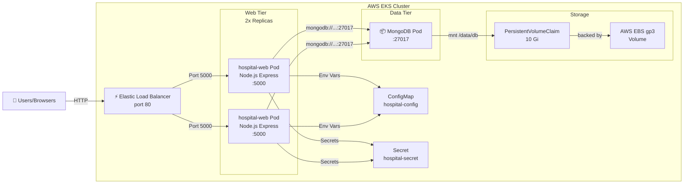

# Hospital Management System - AWS EKS Architecture

Production architecture and operational documentation for the Hospital Management System deployed on AWS EKS.

## System Overview

The Hospital Management System is a full-stack application deployed on AWS EKS (Elastic Kubernetes Service) with a Node.js Express backend, MongoDB database, and a static frontend served over HTTP.

```
┌─────────────────────────────────────────────────────────────────┐
│                       Users / Browsers                           │
└────────────────────────┬──────────────────────────────────────────┘
                         │ HTTPS/HTTP
                         ▼
        ┌────────────────────────────────────────┐
        │  AWS Elastic Load Balancer (NLB)       │
        │  - Public IP Address                   │
        │  - Port 80 (HTTP)                      │
        └─────────────────┬──────────────────────┘
                          │ Internal Traffic
         ┌────────────────┴──────────────────┐
         ▼                                   ▼
    ┌─────────────────┐              ┌──────────────────┐
    │  hospital-web   │              │  hospital-web    │
    │  Pod (Replica1) │              │  Pod (Replica2)  │
    │                 │              │                  │
    │  Node.js        │              │  Node.js         │
    │  Express:5000   │              │  Express:5000    │
    └────────┬────────┘              └────────┬─────────┘
             │                                │
             └────────────────┬───────────────┘
                              │ Internal DNS: hospital-mongodb:27017
                              ▼
                    ┌──────────────────────┐
                    │ hospital-mongodb     │
                    │ Pod                  │
                    │                      │
                    │ MongoDB:27017        │
                    └─────────────┬────────┘
                                  │
                                  ▼
                    ┌──────────────────────────┐
                    │ PersistentVolumeClaim    │
                    │ hospital-mongodb-data    │
                    │ (10 Gi, ReadWriteOnce)   │
                    └─────────────┬────────────┘
                                  │
                                  ▼
                    ┌──────────────────────────┐
                    │ AWS EBS gp3 Volume       │
                    │ 10 GiB SSD Storage       │
                    └──────────────────────────┘
```

## Architecture Diagram (Mermaid)



## Runtime Components

### 1. Load Balancer Service (AWS ELB / NLB)

**Type:** Kubernetes Service with type `LoadBalancer`

```yaml
Name: hospital-web
Type: LoadBalancer
Port: 80
TargetPort: 5000
Backend: hospital-web Pods
```

**Purpose:** 
- Single entry point for all incoming traffic
- AWS automatically provisions an NLB (Network Load Balancer)
- Distributes traffic across web pods
- Manages SSL/TLS termination (optional)

**Features:**
- Automatic health checking via readiness probes
- Cross-zone load balancing
- Low latency with NLB

### 2. Hospital Web Deployment

**Type:** Kubernetes Deployment

```yaml
Name: hospital-web
Replicas: 2 (configurable)
Image: docker.io/angira/hospital-app:1.0.0
Port: 5000/TCP
```

**Container Specifications:**

| Property | Value |
|----------|-------|
| Image | `node:20-alpine` multi-stage build |
| User | `node` (non-root, UID 1000) |
| Working Dir | `/app/backend` |
| Process | `dumb-init node app.js` |

**Security Context:**
- `allowPrivilegeEscalation: false` - No privilege elevation
- `readOnlyRootFilesystem: true` - Read-only filesystem
- `runAsNonRoot: true` - Must run as non-root user
- `capabilities.drop: ["ALL"]` - Drop all Linux capabilities

**Resource Management:**

```yaml
Requests:
  CPU: 100m (0.1 cores)
  Memory: 128Mi
Limits:
  CPU: 500m (0.5 cores)
  Memory: 512Mi
```

**Health Checks:**

| Type | Endpoint | Initial Delay | Period | Timeout | Failures |
|------|----------|---|---|---|---|
| Readiness | `/readyz` | 15s | 10s | 3s | 6 |
| Liveness | `/healthz` | 30s | 20s | 3s | 3 |

**Rolling Update Strategy:**
- Type: RollingUpdate
- maxUnavailable: 0 (no pod downtime)
- maxSurge: 1 (one extra pod during update)

### 3. Hospital MongoDB Deployment

**Type:** Kubernetes Deployment (single replica)

```yaml
Name: hospital-mongodb
Replicas: 1
Image: mongo:7-jammy
Port: 27017/TCP
```

**Storage Configuration:**
- PersistentVolumeClaim: `hospital-mongodb-data`
- Size: 10 GiB
- AccessMode: ReadWriteOnce
- Storage Class: `ebs-gp3`

**Security Context:**
- User: `mongodb` (UID 999)
- fsGroup: 999 (for volume permissions)
- No privilege escalation
- All capabilities dropped

**Resource Management:**

```yaml
Requests:
  CPU: 100m
  Memory: 256Mi
Limits:
  CPU: 1000m (1 core)
  Memory: 1Gi
```

**Health Checks:**

| Type | Protocol | Port | Initial Delay | Period | Timeout | Failures |
|------|----------|------|---|---|---|---|
| Readiness | TCP | 27017 | 10s | 10s | 3s | 6 |
| Liveness | TCP | 27017 | 30s | 20s | 3s | 3 |

**Strategy:** Recreate (stops old pod before starting new one)

### 4. ConfigMap (hospital-config)

**Purpose:** Non-sensitive application configuration

```yaml
NODE_ENV: "production"
PORT: "5000"
MONGO_URI: "mongodb://hospital-mongodb:27017/hospital_management"
```

**Usage:** Injected as environment variables into web pods

### 5. Secret (hospital-secret)

**Purpose:** Sensitive application secrets

```yaml
SESSION_SECRET: <random hex, 32 bytes>
JWT_SECRET: <random hex, 32 bytes>
ADMIN_USERNAME: "admin"
ADMIN_PASSWORD: <strong password>
EMAIL_USER: ""  # Optional
EMAIL_PASS: ""  # Optional
```

**Security:**
- Type: Opaque
- Stored as base64 (at rest encryption recommended)
- Injected as environment variables
- Should be rotated regularly

### 6. PersistentVolumeClaim (PVC)

**Purpose:** Request durable storage for MongoDB

```yaml
Name: hospital-mongodb-data
Size: 10 Gi
AccessMode: ReadWriteOnce
StorageClass: ebs-gp3
```

**AWS EBS Configuration:**
- Provisioner: `ebs.csi.aws.com`
- Type: gp3 (General Purpose SSD)
- File System: ext4
- Volume Binding: WaitForFirstConsumer
- Reclaim Policy: Retain

## Network Flow

### Request Path (User to Application)

```
1. User Browser
   ↓ HTTP Request
2. AWS Load Balancer (NLB)
   - Receives traffic on port 80
   - Performs health checks on /readyz
   - Routes to healthy pods
   ↓
3. hospital-web Service (ClusterIP)
   - Kubernetes DNS: hospital-web.default.svc.cluster.local
   - Resolves to pod IPs
   ↓
4. hospital-web Pod
   - Express.js listens on :5000
   - Serves static files from /public
   - Routes API requests
   - Connects to MongoDB
   ↓
5. hospital-mongodb Service (ClusterIP)
   - Kubernetes DNS: hospital-mongodb.default.svc.cluster.local
   - Resolves to MongoDB pod IP
   ↓
6. MongoDB Pod
   - Listens on :27017
   - Queries database
   - Stores session data
   - Persists to /data/db (EBS volume)
   ↓
7. AWS EBS gp3 Volume
   - Block-level storage
   - Durable across pod restarts
   - Cross-AZ replication (via snapshot backups)
```

### DNS and Service Discovery

**Internal Kubernetes DNS:**
- Web pods can reach MongoDB at: `mongodb://hospital-mongodb:27017`
- Full FQDN: `mongodb://hospital-mongodb.default.svc.cluster.local:27017`
- Automatically resolved by kubelet

**LoadBalancer DNS:**
- Example: `hospital-web-1234567890.ap-south-1.elb.amazonaws.com`
- Auto-provisioned by AWS
- Can be mapped to custom DNS record

## Availability & High Availability

### Pod Replica Strategy

| Component | Replicas | Strategy | Justification |
|-----------|----------|----------|---|
| hospital-web | 2 (default, configurable up to 5) | RollingUpdate | High availability, graceful updates |
| hospital-mongodb | 1 | Recreate | Stateful, avoid split-brain |

### Readiness & Liveness Probes

**Readiness Probe (`/readyz`):**
- Checks if application is ready to accept traffic
- Returns 200 only when MongoDB is connected
- If fails, removes pod from load balancer
- Prevents routing traffic to degraded pods

**Liveness Probe (`/healthz`):**
- Checks if application process is responsive
- Returns 200 if Node.js process is healthy
- If fails repeatedly, Kubernetes restarts the pod
- Recovers from transient failures

**Probe Tuning:**
```
Readiness:
- Runs every 10 seconds after 15s startup
- Fails if no response in 3 seconds
- Removes from LB after 6 consecutive failures

Liveness:
- Runs every 20 seconds after 30s startup
- Fails if no response in 3 seconds
- Restarts pod after 3 consecutive failures
```

### Rolling Updates

```
1. Scale up: +1 new pod with new image
   - totalPods = 2 (old) + 1 (new) = 3
2. Health check: new pod passes readiness
3. Route traffic: LB sends new traffic to new pod
4. Scale down: -1 old pod
   - totalPods = 1 (old) + 1 (new) = 2
5. Repeat: until all pods updated
6. Result: Zero-downtime rolling update
```

## Data Persistence

### MongoDB Data Flow

```
Application → MongoDB → PersistentVolumeClaim → AWS EBS Volume
```

### Storage Characteristics

| Aspect | Value |
|--------|-------|
| Volume Type | AWS EBS gp3 |
| Size | 10 GiB (configurable) |
| Performance | 3000 IOPS, 125 MiB/s (baseline) |
| Availability | Multi-AZ snapshots |
| Durability | 99.999% durability |
| Access Mode | ReadWriteOnce (single pod) |

### Volume Lifecycle

```
1. PVC Created: hospital-mongodb-data (10 Gi request)
2. StorageClass ebs-gp3: Automatically provisions EBS volume
3. PV Created: Dynamically bound to PVC
4. Volume Mounted: /data/db in MongoDB pod
5. Data Written: MongoDB persists to volume
6. Pod Restart: Volume remains, data preserved
7. Pod Delete: PVC remains (reclaimPolicy: Retain)
8. Manual Cleanup: Optional manual PV deletion
```

## Security Architecture

### Network Security

- **Network Policies:** Can be enabled to restrict pod-to-pod communication
- **Service Type Isolation:**
  - hospital-web: LoadBalancer (public)
  - hospital-mongodb: ClusterIP (internal only)
- **Security Groups:** AWS security groups control inbound/outbound traffic

### Pod Security

- **Non-root User:** All containers run as non-root (UID 1000 for app, 999 for MongoDB)
- **Read-only Filesystem:** Web app has read-only root filesystem
- **No Privilege Escalation:** allowPrivilegeEscalation: false
- **Dropped Capabilities:** ALL Linux capabilities dropped
- **SELinux/AppArmor:** Can be enforced at cluster level

### Secret Management

- **Encrypted Secrets:** At-rest encryption recommended (AWS KMS)
- **RBAC:** ServiceAccountToken disabled for pods (no Kubernetes API access)
- **Secret Rotation:** Regularly update SESSION_SECRET, JWT_SECRET, ADMIN_PASSWORD
- **Audit Logging:** All secret access logged in Kubernetes audit

## Monitoring & Observability

### Health Checks

Built-in endpoints:
- `/healthz` - Liveness probe endpoint
- `/readyz` - Readiness probe endpoint
- `/api/*` - Application-specific API endpoints

### Logging

```
Pod logs: kubectl logs -f <pod-name>
- Application logs (Express, Mongoose)
- MongoDB logs
- Session connection logs
```

### Metrics

Exposed metrics:
- Pod CPU and memory utilization
- Network I/O
- Storage I/O
- Replica set status

Tools for monitoring:
- Kubernetes Metrics Server
- Prometheus + Grafana
- AWS CloudWatch Container Insights

## Disaster Recovery

### Backup Strategy

```
1. MongoDB Data:
   - Automatic EBS snapshots
   - Point-in-time recovery capability
   - Consider backing up to S3 (MongoDB Atlas Backup)

2. Application Code:
   - Version-tagged Docker images on Docker Hub
   - Git repository with release tags

3. Configuration:
   - Helm chart in Git
   - values.yaml versioned
   - Secrets in AWS Secrets Manager
```

### Recovery Procedures

```
1. Pod Failure:
   - Kubernetes automatically restarts pod
   - Data preserved on EBS volume

2. Node Failure:
   - Pod reschedules on healthy node
   - EBS volume reattached

3. Data Corruption:
   - Restore from EBS snapshot
   - MongoDB point-in-time recovery

4. Complete Cluster Failure:
   - Redeploy using Helm chart
   - Restore MongoDB from snapshot
   - Verify data integrity
```

## Scaling Considerations

### Horizontal Pod Autoscaling (HPA)

```yaml
Example HPA Configuration:
minReplicas: 2
maxReplicas: 5
targetCPUUtilizationPercentage: 70
```

### Vertical Scaling (Resource Limits)

Adjustable in values.yaml:
```yaml
resources:
  requests:
    cpu: 200m      # Can increase to 500m
    memory: 256Mi  # Can increase to 512Mi
  limits:
    cpu: 500m      # Can increase to 1000m
    memory: 512Mi  # Can increase to 2Gi
```

### Storage Scaling

```
Current: 10 Gi MongoDB storage
Expansion: PVC can be expanded if storageClass.allowVolumeExpansion: true
New size: kubectl patch pvc hospital-mongodb-data -p '{"spec":{"resources":{"requests":{"storage":"20Gi"}}}}'
```

## Production Best Practices Implemented

✅ **Containerization:** Multi-stage Docker build  
✅ **Non-root User:** Runs as node:node (UID 1000)  
✅ **Security Context:** Comprehensive pod and container security  
✅ **Resource Management:** Requests and limits defined  
✅ **Health Checks:** Readiness and liveness probes configured  
✅ **Data Persistence:** EBS-backed PVC for MongoDB  
✅ **Rolling Updates:** Zero-downtime deployments  
✅ **Service Discovery:** Kubernetes DNS for internal communication  
✅ **Secrets Management:** Kubernetes Secrets with RBAC  
✅ **Image Versioning:** Immutable version tags  
✅ **Infrastructure as Code:** Helm chart for repeatable deployments  

## Operational Tasks

### View All Resources

```bash
kubectl get all -n hospital
kubectl describe deployment hospital-web -n hospital
kubectl describe pvc hospital-mongodb-data -n hospital
```

### Monitor Health

```bash
kubectl get events -n hospital --sort-by='.lastTimestamp'
kubectl top pods -n hospital
kubectl logs -f deployment/hospital-web -n hospital
```

### Update Image

```bash
kubectl set image deployment/hospital-web \
   hospital-web=angira/hospital-app:1.1.0 \
   -n hospital
```

### Scale Deployment

```bash
kubectl scale deployment/hospital-web --replicas=3 -n hospital
```

### Backup MongoDB

```bash
kubectl exec -it deployment/hospital-mongodb -n hospital -- \
  mongodump --out=/tmp/backup
kubectl cp hospital/hospital-mongodb-xxx:/tmp/backup ./backup
```

---

**Architecture Version:** 1.0.0  
**Last Updated:** 2026-05-30  
**Maintained By:** DevOps Team

- Privilege escalation is disabled for the web container.
- The web container root filesystem is read-only.
- Service account token mounting is disabled where the pods do not need Kubernetes API access.
- MongoDB is exposed only inside the cluster through a ClusterIP Service.

## Persistence

MongoDB uses a `ReadWriteOnce` PersistentVolumeClaim backed by the AWS EBS CSI driver. The StorageClass uses gp3 volumes, `WaitForFirstConsumer` binding, `Retain` reclaim policy, and volume expansion support.

## Release Strategy

- Use immutable Docker image tags, for example `1.0.0`, `1.0.1`, and Git SHA tags.
- Promote releases through Helm by changing `image.tag`.
- Store production secret overrides outside the repository.
- Use `helm rollback` for failed releases.
